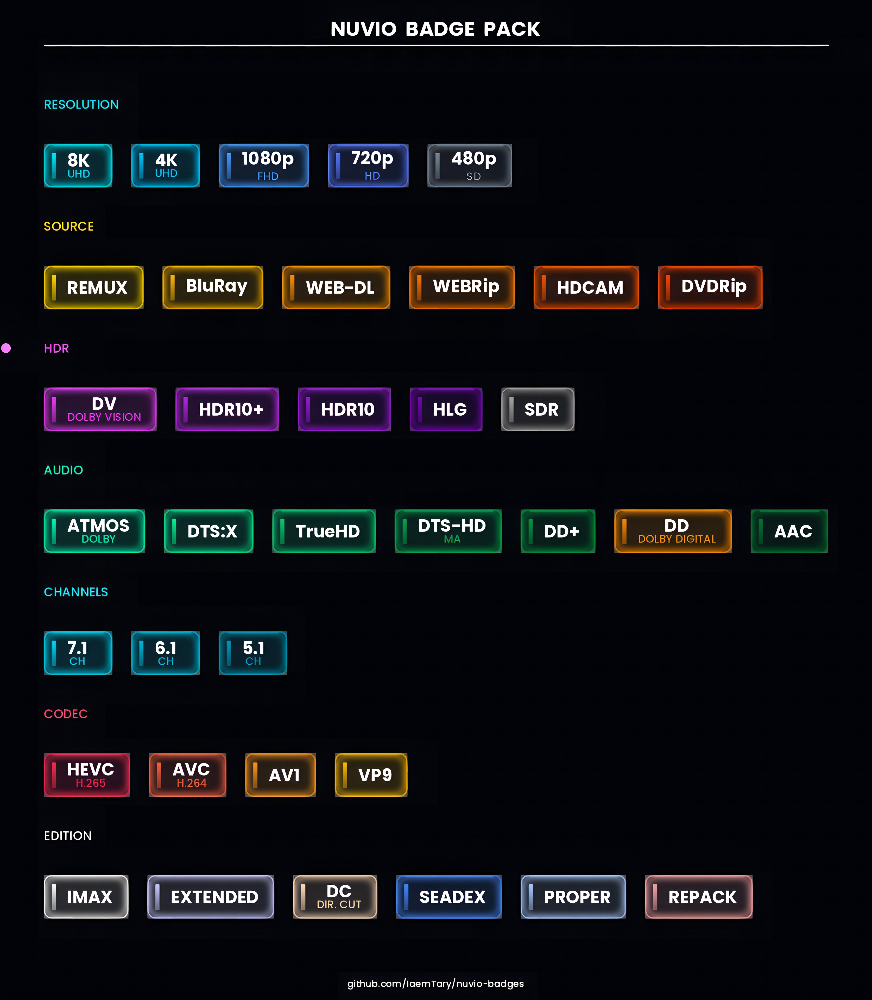

# Nuvio Badge Pack 🎬
> Premium SVG media metadata badges, vector quality at any screen size



## Categories (36 badges)
| Category | Badges |
|---|---|
| Resolution | 8K · 4K · 1080p · 720p · 480p |
| Source | REMUX · BluRay · WEB-DL · WEBRip · HDCAM · DVDRip |
| HDR | Dolby Vision · HDR10+ · HDR10 · HLG · SDR |
| Audio | Atmos · DTS:X · TrueHD · DTS-HD MA · DD+ · Dolby Digital · AAC |
| Channels | 7.1 · 6.1 · 5.1 |
| Codec | HEVC · AVC · AV1 · VP9 |
| Edition | IMAX · EXTENDED · DC · SeaDex · PROPER · REPACK |

## Import into Nuvio
1. Get the raw URL of `badges.json` below:
   ```
   https://raw.githubusercontent.com/IaemTary/nuvio-badges/main/badges.json
   ```
2. In Nuvio → **Settings** → Streams→ Fusion Badge URLs→ paste it ✓
